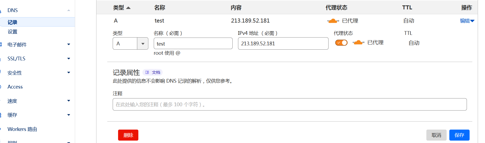
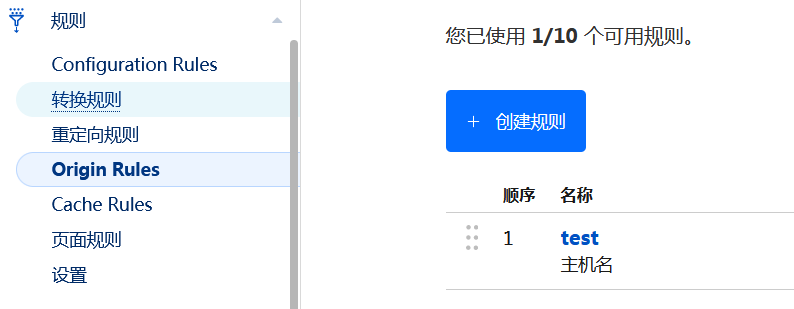
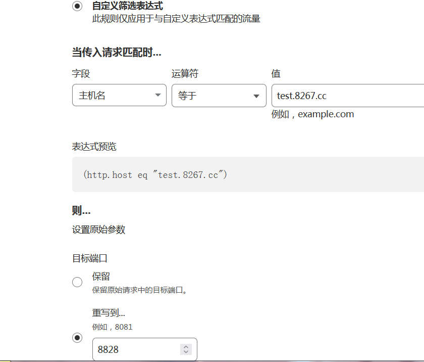

# short-url 缩短链接服务
<p align="center">
<a href="https://github.com/lmq8267/short-url-go/releases"></a
<a href="https://github.com/lmq8267/short-url-go/graphs/contributors"></a
<a href="https://github.com/lmq8267/short-url-go/releases/"></a
<a href="https://github.com/lmq8267/short-url-go/issues"></a
<a href="https://github.com/lmq8267/short-url-go/discussions"></a
<a href="GitHub repo size"></a
<a href="https://github.com/lmq8267/short-url-go/actions?query=workflow%3ABuild"></a
</p>

### 预览
[tt.cnqq.cloudns.ch](https://tt.cnqq.cloudns.ch/)


### 参数
```bash
-p [端口号] 监听指定端口号,默认8080
-d [目录路径] 指定数据存放目录路径，默认当前程序路径的./short_data
-e [邮箱地址] 指定邮箱地址，修改页面的邮箱地址
-f  后台运行,此模式下请加-d 参数指定数据路径
```

### 运行
```bash
./shortener -p 8080 -e email@test.cloudns.be 
```
浏览器输入`http://本地ip:8080`打开主页<br>
[s4.serv00.com:8828](http://s4.serv00.com:8828)

数据保存在`./short_data/`目录里,以后缀名.json保存，重置后缀密码，直接清除里面的`"password": "",`即可<br>
更换背景图在`./short_data/short_data.json`里面的`"img": "你的图片.jpg"`

使用cf的转发规则，可以去掉端口<br>
例如在serv00免费服务器部署<br>
在serv00运行后，去cf添加服务器的IP记录

然后再去添加转发规则


这样就可以直接使用你的域名访问了
[tt.cnqq.cloudns.ch](https://tt.cnqq.cloudns.ch/)

### API
```badh
curl -k 'http://你的域名地址/api' -X POST -d '{ \
  "longUrl": "长链接", \
  "shortCode": "后缀", \
  "type": "link", \
  "expiration": "", \
  "burn_after_reading": false, \
  "password": "" \
}'
```
其中 `longUrl` 表示 长链接或者文本内容<br>
`shortCode` 表示 后缀<br>
`type` 表示功能 `link`是链接 `text`是文本 `html`是网页<br>
`expiration` 表示有效期（分钟） 整数，留空表示永久有效<br>
`burn_after_reading` 表示是否启用阅后即焚 `false`关闭 `true`开启<br>
`password` 表示后缀密码，下次更新这个后缀的内容需要使用相同的密码才能更新<br>

### Docker
```bash
docker run --name shortener -p 12345:8080/tcp -v /etc/short_data:/usr/bin/short_data --restart=always -d lmq8267/shortener

```
其中`-p 12345:8080/tcp` 表示映射主机上的`12345`端口到容器内部`8080`端口 可以自定义你的端口<br>
     `-v /etc/short_data/:/usr/bin/short_data/` 表示挂载主机上的`/etc/short_data/`文件夹到容器内部的数据库目录`/usr/bin/short_data/`<br>
